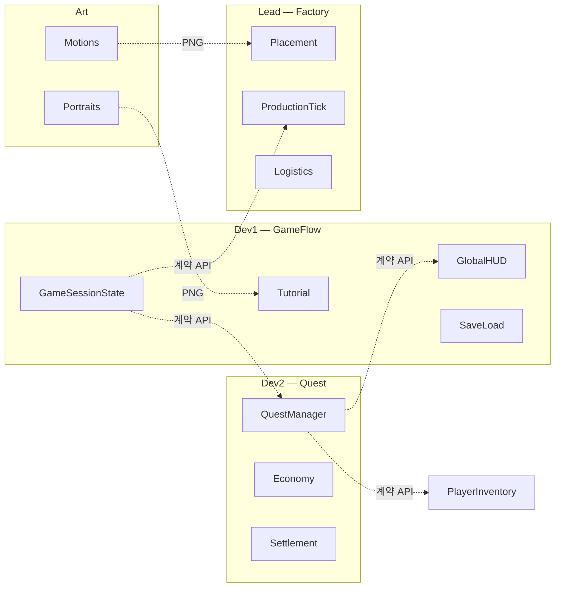
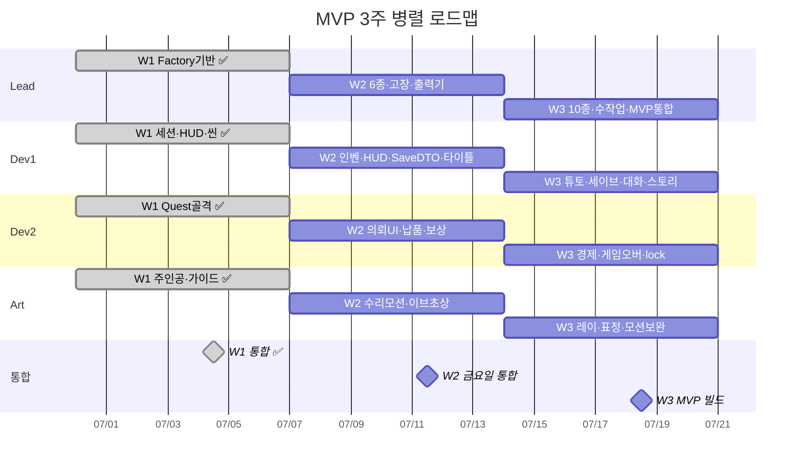
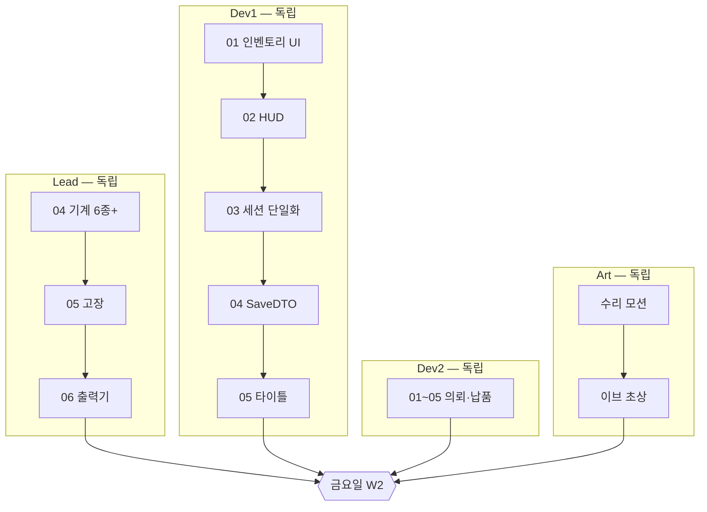
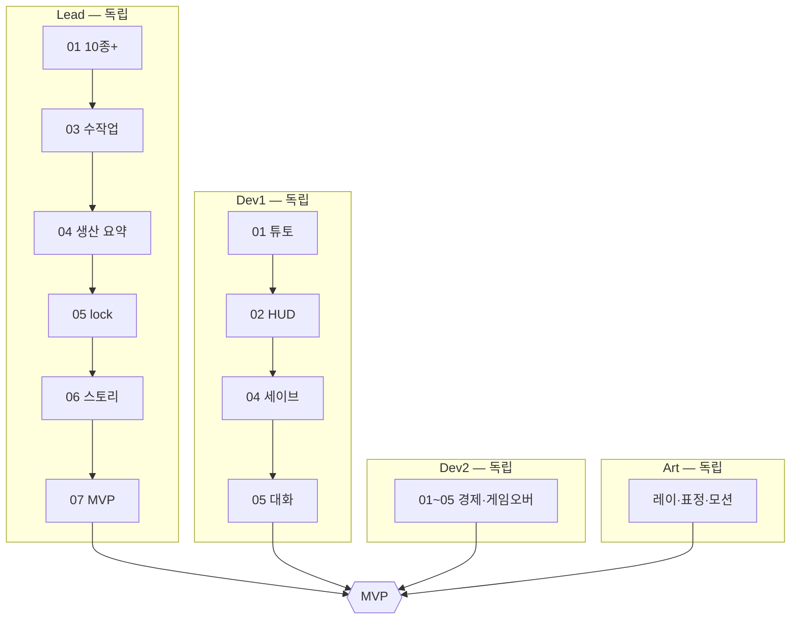
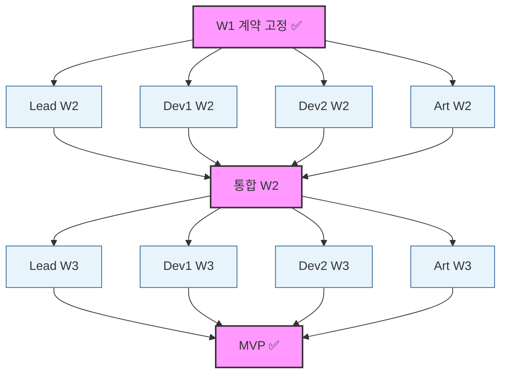

# 병렬 개발 로드맵 (3주)

> **기준 문서**: [dev-plan.md](./dev-plan.md) · [lead-plan.md](./lead-plan.md) · [dev-contract.md](./dev-contract.md)  
> **팀**: Lead · Dev1 · Dev2 · Art (4명)  
> **목적**: **3주 안에 MVP 완료**. 각 주차에서 4명의 작업은 **서로 기다리지 않고** 병렬 진행, **금요일 통합**에서만 합친다.

---

## 독립 작업 원칙

| 규칙 | 내용 |
|------|------|
| 평일 | 각자 Mock·스텁으로 자기 트랙만 개발. **다른 역할의 미완 구현을 전제로 하지 않는다** |
| 계약 | [dev-contract.md](./dev-contract.md) public API만 읽기·쓰기. W1 종료 시 고정 |
| 금요일 | 4트랙 머지 → 통합 데모. 이때만 실연동 검증 |
| Dev1 ↔ Dev2 | 서로의 폴더·UI Manager **미수정**. 이벤트·계약 API만 사용 |
| Lead ↔ Dev | Lead는 `GameFlow/`·`Quest/` **읽기만**. Dev는 Factory 씬 **미수정** |

점선 = **금요일 통합 시** 연결. 평일에는 끊고 Mock 사용.

---

## 전체 타임라인

---

## Week 1 — 기반 ✅

배치·틱·벨트·WIP·SO·`GameSessionState`·`QuestManager` 골격 등 **구현 완료**.  
기획 참고: [week1/week1.md](./week1/week1.md)

**계약 고정**: `GameSessionState` · `PlayerInventory` · `Quest` SO · Contracts Items

---

## Week 2 — 의뢰 UI · 납품 · 6종+

| 역할 | Issue | Mock (평일) |
|------|-------|-------------|
| Lead | [week2-lead/](./week2/week2-lead/) | Dev1 페이즈 수동 토글 |
| Dev1 | [week2-dev1/](./week2/week2-dev1/) | `QuestManager` → HUD `0/3` |
| Dev2 | [week2-dev2/](./week2/week2-dev2/) | 인벤에 Contracts Items `Add()` |
| Art | [week2-art/](./week2/week2-art/) | — |

---

## Week 3 — MVP 완성

| 역할 | Issue | Mock (평일) |
|------|-------|-------------|
| Lead | [week3-lead/](./week3/week3-lead/) | `StoryEventBus.RaiseMock()` |
| Dev1 | [week3-dev1/](./week3/week3-dev1/) | `factory: null`, `quests: []` |
| Dev2 | [week3-dev2/](./week3/week3-dev2/) | reputation 하드코딩 |
| Art | [week3-art/](./week3/week3-art/) | — |

---

## 의존성 그래프 (통합 게이트만 연결)

실선 = 해당 주 **내부** 순서. 다른 역할 간 화살표는 **금요일에만** 연결.

---

## Mock 요약표

| 소비자 | 필요 대상 | 평일 Mock |
|--------|-----------|-----------|
| Dev1 HUD | `QuestManager` | `의뢰: 0/3` 하드코딩 |
| Dev1 세이브 | Lead `IFactorySave` | `factory: null` 저장 |
| Dev1 스토리 | Lead `StoryEventBus` | `RaiseMock(id)` 로컬 테스트 |
| Dev2 의뢰 | `PlayerInventory` | Contracts Items `Add()` |
| Dev2 경제 | 명성 해금 표 | reputation 임의값 |

---

## 브랜치·머지 규칙

| 규칙 | 내용 |
|------|------|
| 브랜치 | `lead/wN-*`, `dev1/wN-*`, `dev2/wN-*`, `art/wN-*` |
| 금요일 머지 순서 | Dev1 → Dev2 → Lead → Art → `develop` |
| 계약 변경 | `GameSessionState`·`QuestManager` public API 변경 시 **#dev-contract** 1일 전 공지 |

---

## 금요일 통합 데모

| 주차 | 시나리오 |
|------|----------|
| **W1** ✅ | Factory 이동 → 생산 타이머 → 결산 1회전 |
| **W2** | NewGame → 인벤 UI → 의뢰 수락 → Lead 배치 → 생산 틱 → 결산 **납품·보상** → 다음 날 |
| **W3** | 타이틀 슬롯 → 로드 → 튜토 2단계 → 10종+·벨트 체인 생산 → 스토리 이벤트 → 클리어 의뢰 납품 → 세이브·재시작 |

---

## 관련 문서

- [dev-plan.md](./dev-plan.md) — MVP 범위·3주 일정표
- [dev-contract.md](./dev-contract.md) — API·에셋 계약
- [lead-plan.md](./lead-plan.md) — Lead 상세
- [week2/team-integration.md](./week2/team-integration.md) — W2 통합 체크리스트
- [week3/week3-dev1/06-team-integration.md](./week3/week3-dev1/06-team-integration.md) — W3 통합 체크리스트
