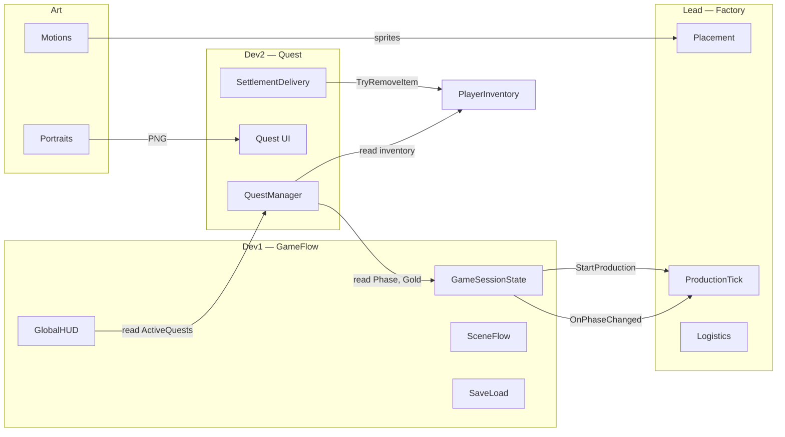
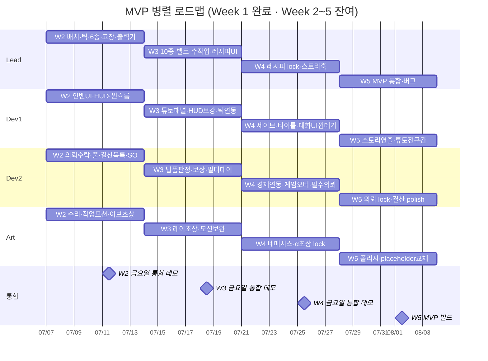
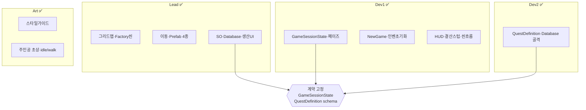
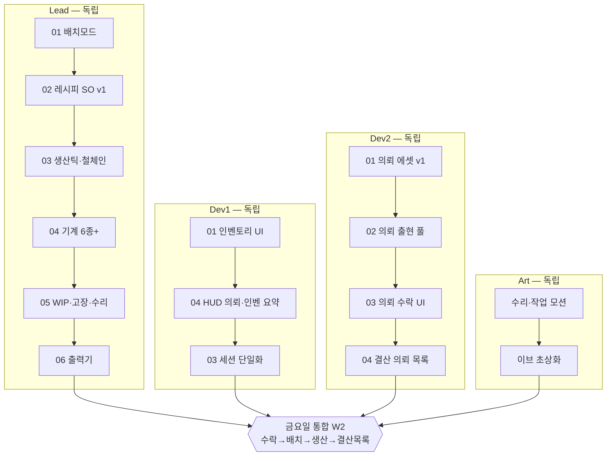
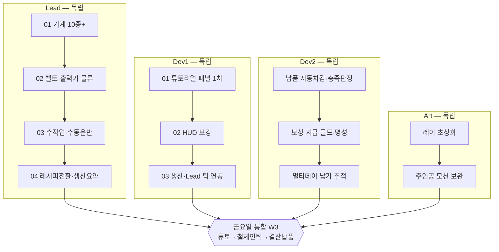
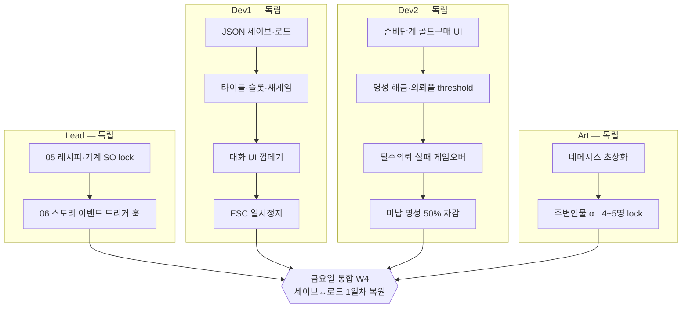
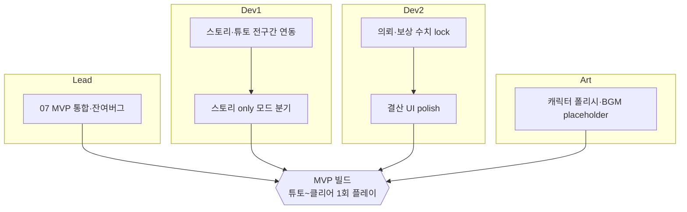
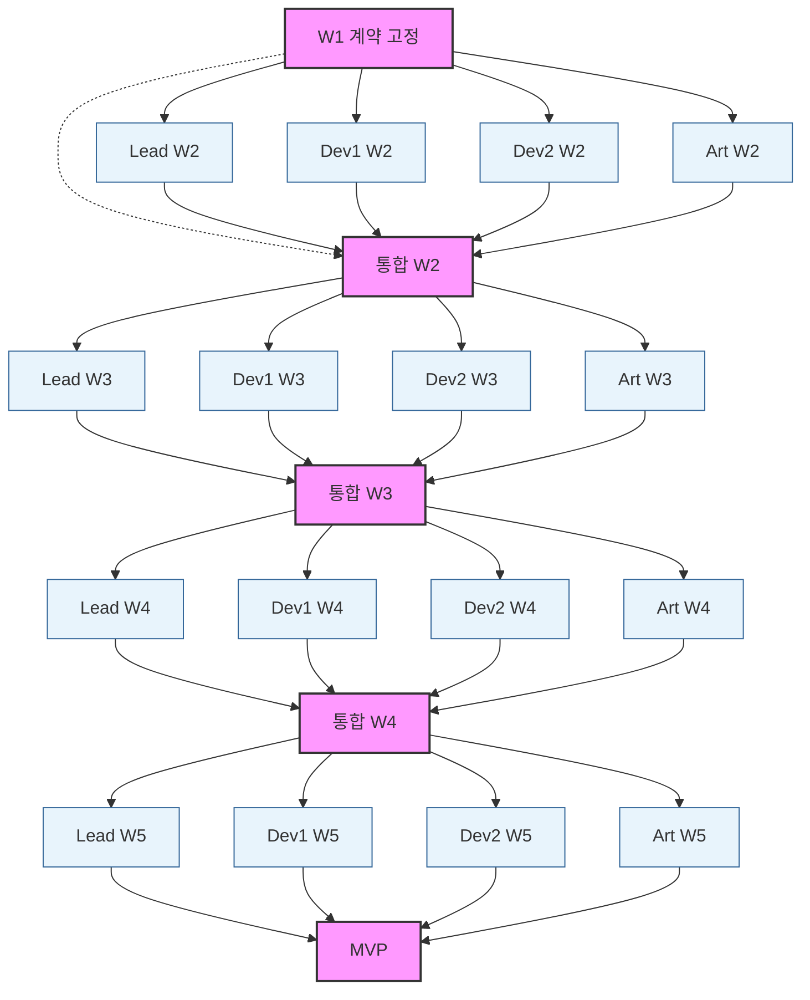

# 병렬 개발 로드맵

> **기준 문서**: [dev-plan.md](./dev-plan.md) · [lead-plan.md](./lead-plan.md) · [02-data-structure.md](../02-data-structure.md) · **[dev-contract.md](./dev-contract.md)**  
> **목적**: 팀원이 **서로의 미완 작업에 막히지 않고** 각자 브랜치에서 개발한 뒤, **금요일 통합 게이트**에서 합칠 수 있도록 재구성한 일정.

---

## 팀 역할

| 역할 | 담당 | 코드·에셋 소유 |
|------|------|----------------|
| **Lead** | 공장 **내부** — 맵·배치·생산 틱·물류·기계 SO·공장 UI | `Assets/Scripts/Placement/`, `Production/`, `Item/`(기계·레시피), Factory 씬 |
| **Dev1** | 공장 **외부** — **게임 플로우** (세션·페이즈·씬·HUD·튜토·세이브·타이틀) | `Assets/Scripts/GameFlow/` |
| **Dev2** | 공장 **외부** — **의뢰** (풀·수락·납기·결산 납품·보상·게임오버) | `Assets/Scripts/Quest/` |
| **Art** | 초상화·주인공 모션 (코드 없음) | `Assets/Art/` |

**Dev1 ↔ Dev2 분리 원칙**: Dev1은 의뢰 **상태를 읽고 이벤트만 구독**한다. Dev2는 `GameSessionState` **읽기** + `PlayerInventory` **계약 API**만 호출한다. **서로의 UI·Manager 내부를 수정하지 않는다.** Dev1은 Dev2 UI(`orderWindow` 등)를 토글하지 않는다.

---

## 독립 작업을 위한 계약 (Contract)

통합 전에도 각 트랙이 **목(Mock)·스텁**으로 동작할 수 있도록, 아래 인터페이스를 **Week 1 종료 시점에 고정**한다.  
**상세 시그니처·쓰기 권한**: [dev-contract.md](./dev-contract.md)

| 계약 | 소유 | 제공 (다른 역할이 쓰는 것) | 소비자 | Mock 방법 |
|------|------|---------------------------|--------|-----------|
| `GameSessionState` | Dev1 | `Phase`, `Day`, `Gold`, `Reputation`, `OnPhaseChanged`, `StartProduction()`, `AdvanceDay()` | Lead, Dev2 | Lead: 페이즈만 수동 토글하는 테스트 씬 |
| `PlayerInventory` | Dev1 | `GetCount`, `OnMachinesChanged`, `OnItemsChanged`, 배치 API | Lead, Dev2 | Dev2: Contracts Items로 `Add()` |
| `QuestManager` | Dev2 | `ActiveQuests`, `TryAccept`, `OnQuestAccepted` | Dev1 HUD | Dev1: `0/3` 하드코딩 |
| `IFactoryProduction` | Lead | `StartTick()`, `StopTick()`, `IsRunning` | Dev1 | Dev1: `NullFactoryProduction` 스텁 |
| **Contracts Items** | Lead | `Assets/Data/Contracts/Items/` | Dev2 | Dev2: 동일 id placeholder SO |
| Art drop zone | Art | `Assets/Art/UI/Portraits/`, `Assets/Art/Characters/Protagonist/` | Lead, Dev1 | Placeholder 색상 PNG |

---

## 전체 타임라인 (병렬 레인)

---

## 주차별 병렬 작업 그래프

### Week 1 — 완료 ✅

---

### Week 2 — 배치·의뢰 UI (현재)

**병렬 원칙**: Dev1 `GameSessionState` 단일화. Dev2 UI는 `OnPhaseChanged` 자체 구독. Dev2 Quest SO는 `Assets/Data/Contracts/Items/`만 참조.

| 역할 | Issue (기존 문서) | 완료 시 다른 팀에 줄 것 |
|------|-------------------|------------------------|
| Lead | [week2-lead/](./week2/week2-lead/) | `IFactoryProduction` 구현, 배치 시 `PlayerInventory` 갱신 |
| Dev1 | [week2-dev1/](./week2/week2-dev1/) 01, 02, 03 | `OnPhaseChanged` 이벤트, 인벤 UI |
| Dev2 | [week2-dev2/](./week2/week2-dev2/) 01~04 | `QuestManager.TryAccept`, `ActiveQuests` |
| Art | [week2-art/](./week2/week2-art/) | 모션 시트·이브 PNG → 고정 경로 |

---

### Week 3 — 생산 연동·튜토·납품

**병렬 원칙**: Dev1의 틱 연동은 Lead `ProductionTickSystem` **인터페이스**에만 의존 (구현 없으면 스텁). Dev2 납품 판정은 Lead 생산 결과와 **무관** — 인벤 아이템 수만 검사.

---

### Week 4 — 세이브·경제·대화 UI

**병렬 원칙**: Dev1 세이브 DTO는 [dev-contract.md](./dev-contract.md) · [02-data-structure.md](../02-data-structure.md) **W4 시작 전 동결**. Dev2는 `quests[]` 필드만 직렬화 구현.

---

### Week 5 — MVP 통합·폴리시

---

## 의존성 그래프 (통합 게이트만 연결)

실선 = 해당 주 **내부** 순서. 점선 = **금요일에만** 합치는 지점. 평일에는 점선을 끊고 각자 Mock으로 개발.

---

## 브랜치·머지 규칙

| 규칙 | 내용 |
|------|------|
| 브랜치 | `lead/w2-*`, `dev1/w2-*`, `dev2/w2-*`, `art/w2-*` — 역할·주차별 |
| 금요일 | 각자 `develop`에 PR → **통합 담당(Lead)** 이 머지 순서: Dev1 → Dev2 → Lead → Art |
| 충돌 방지 | Dev1·Dev2는 **서로의 폴더 미수정**. Lead는 `GameFlow/`·`Quest/` **읽기만** |
| 씬 변경 | Factory 씬 = Lead, Settlement·Title = Dev1, Quest UI 프리팹 = Dev2 |
| 계약 변경 | `GameSessionState`·`QuestManager` public API 변경 시 **#dev-contract** 채널에 하루 전 공지 |

---

## 금요일 통합 데모 시나리오

| 주차 | 시나리오 | 검증 계약 |
|------|----------|-----------|
| **W2** | NewGame → 인벤 UI → 의뢰 수락(0/3→1/3) → Lead 배치 → 생산 1회전 → 결산 n/m → 다음 날 | `QuestManager`, `OnPhaseChanged`, 인벤 갱신 |
| **W3** | 튜토 패널 2단계 → 생산 중 철 체인 틱 → 결산 납품·보상 → HUD 갱신 | `IFactoryProduction`, `EvaluateDelivery` |
| **W4** | 저장 → 종료 → 로드 → 필수 의뢰 실패 시 게임오버 → 다른 슬롯 | 세이브 JSON, `GameOver` |
| **W5** | 1일차~클리어 의뢰 라인 1회 플레이 (스토리 only 옵션) | MVP 완료 기준 7항 ([dev-plan.md](./dev-plan.md)) |

---

## Dev1 vs Dev2 Issue 매핑 (기존 week2~3 문서)

| 기존 Issue | 담당 | 비고 |
|------------|------|------|
| 01-session-phase, 02-new-game, 03-global-hud, 04-settlement-stub, 05-scene-flow | **Dev1** | W1 완료 |
| 06-quest-data | **Dev2** | W1 골격 → W2 에셋 v1에서 확장 |
| 01-inventory-ui, 02-hud-quest-summary, 03-scene-flow-enhancement | **Dev1** | [week2-dev1/](./week2/week2-dev1/) · HUD는 Quest 이벤트 구독만 |
| 01-quest-assets-v1, 02-quest-pool, 03-quest-accept-ui, 04-settlement-quest-list | **Dev2** | [week2-dev2/](./week2/week2-dev2/) · 순서 01→04 |
| 01-tutorial-panel, 02-hud-enhancements, 03-production-integration | **Dev1** | W3 · 03은 Lead 인터페이스 연동 |
| team-integration (W2) | **전원** | [week2/team-integration.md](./week2/team-integration.md) |

---

## 관련 문서

- [dev-plan.md](./dev-plan.md) — MVP 범위·7주 원본 일정
- [lead-plan.md](./lead-plan.md) — Lead 3주 상세
- [week2/week2.md](./week2/week2.md) · [week3/week3.md](./week3/week3.md) — 현재 주차 Issue
- [dev-contract.md](./dev-contract.md) — **팀 간 API·에셋 계약 (고정)**
- [dev-gaps.md](./dev-gaps.md) — 미정 항목
