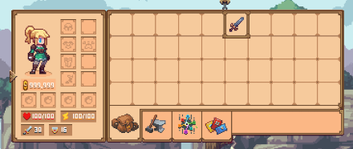
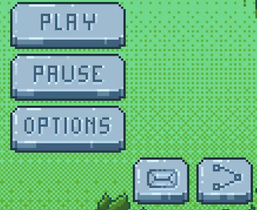

# UI 공통 프레임

**역할**: Art · **Week**: 4 · **Issue**: 01  
**선행**: Week 1 스타일 가이드 · W3 이브·레이 초상

## 1. 이 작업물

뒷산 플레이 UI용 공통 패널·버튼 스프라이트.  
게임에서는 9-slice로 쓰지만, 9-slice 설정·적용은 이 Issue 범위 밖(본인이 처리).

**경로**: `Assets/Art/UI/Frames/`

## 2. 패널 스타일 (ref)

갈색 베이스 · 깔끔한 테두리 · 끝만 아주 살짝 둥근 직각.

## 3. 버튼 스타일 (ref)

패널과 같은 갈색이지만 **약간 밝게**. ref처럼 **약간의 입체감**.  
눌림: **살짝 어두워지며 세로로 줄어듦**. 9-slice.

## 4. 산출물

| 파일 | 용도 |
|------|------|
| `panel_frame.png` | 프레임 + 속이 채워진 버전 **1장** (대화·튜토·모달 공용) |
| `button_normal.png` | 기본(밝고 입체) |
| `button_pressed.png` | 눌림(어둡고 세로로 짧음) |

## 5. 완료 기준

- [ ] 패널 1장: 갈색·깔끔한 테두리·살짝 둥근 직각
- [ ] 버튼 normal: 패널보다 밝은 갈색 + 입체감
- [ ] 버튼 pressed: 살짝 어둡고 세로로 줄어든 형태
- [ ] W3 초상과 화풍 충돌 없음
- [ ] `Assets/Art/UI/Frames/`에 배치
