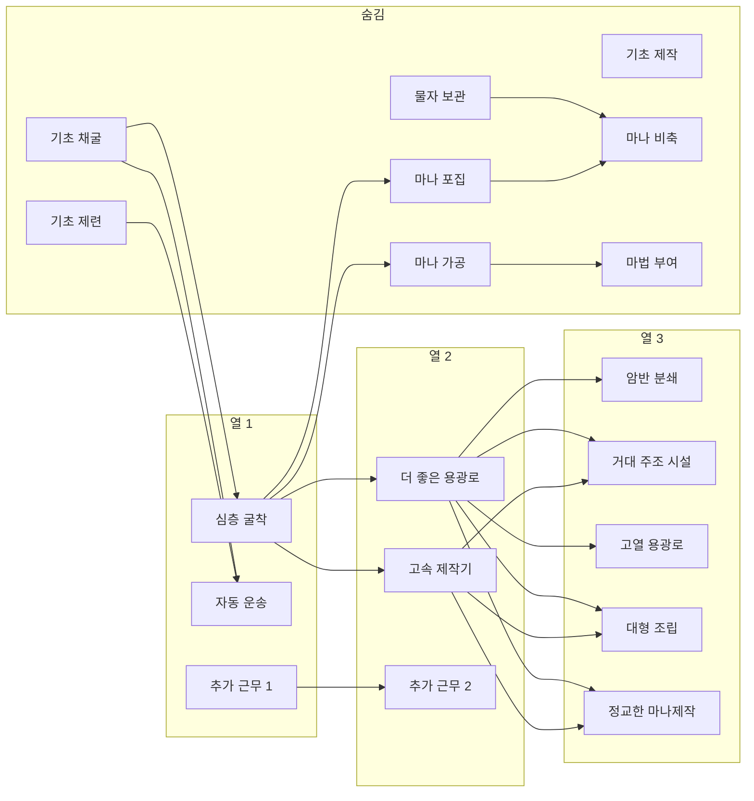

# 테크 트리 배치

재배치용 작업 문서. 정본 코드는 `Assets/Scripts/GameFlow/TechTreeCatalog.cs`.

이 문서의 **선행**을 고친 뒤 반영을 요청하면 된다.

## 읽는 법

- **왼쪽 → 오른쪽**: 진행 방향 (열)
- **위 → 아래**: 같은 열의 갈래 (채굴 / 마나·저장 / 제련 / 제작)
- **선행**: 적힌 것을 **전부** 열어야 함 (AND)
- `(시작)`: 트리에 안 그림. 이미 열린 것으로 침
- `(Q002)`: 트리에 안 그림. 레이에게 골드 1을 주는 2번째 메인 의뢰를 마치면 자동으로 열림
- 명예는 선행과 별개. 선행이 돼도 명예가 부족하면 안 열림

## 한눈에

## 열별 목록

갈래: **채굴** / **저장·운송** / **제련** / **제작·마나** / **연료**

선행을 바꾸려면 `←` 오른쪽만 고치면 된다. 여러 개는 `+` 로 AND.

### 숨김 · 시작 / Q002

트리에 그리지 않음. 시작 4개는 처음부터 열린 것으로 침. 마나 4개는 Q002 완료 시 자동.

| 갈래 | 이름 | id | 명예 | 선행 |
|------|------|-----|------|------|
| 채굴 | 기초 채굴 | `m_drill_1` | 0 | (시작) |
| 저장·운송 | 물자 보관 | `m_warehouse_1` | 0 | (시작) |
| 제련 | 기초 제련 | `m_furnace_1` | 0 | (시작) |
| 제작·마나 | 기초 제작 | `m_crafter_1` | 0 | (시작) |
| 저장·운송 | 마나 포집 | `m_manaext_1` | 자동 | (Q002) |
| 제작·마나 | 마나 가공 | `m_manacraft_1` | 자동 | (Q002) |
| 저장·운송 | 마나 비축 | `m_manastore_1` | 자동 | (Q002) |
| 제작·마나 | 마법 부여 | `m_enchant_1` | 자동 | (Q002) |

### 열 1

| 갈래 | 이름 | id | 명예 | 선행 |
|------|------|-----|------|------|
| 채굴 | 심층 굴착 | `m_drill_2` | 40 | 기초 채굴 |
| 저장·운송 | 자동 운송 | `m_conveyor_1` | 20 | 기초 채굴 + 기초 제련 |
| 연료 | 추가 근무 1 | `fuel_1` | 80 | (없음, 언제든) |

### 열 2

| 갈래 | 이름 | id | 명예 | 선행 |
|------|------|-----|------|------|
| 제련 | 더 좋은 용광로 | `m_furnace_2` | 850 | 심층 굴착 |
| 제작·마나 | 고속 제작기 | `m_crafter_2` | 850 | 심층 굴착 |
| 연료 | 추가 근무 2 | `fuel_2` | 220 | 추가 근무 1 |

### 열 3

같은 열끼리 선행으로 묶지 않음. 의식 세공·제단 건립 항목은 없음. 그 기계는 아래 테크가 연다.

| 갈래 | 이름 | id | 명예 | 선행 | 같이 열리는 기계 |
|------|------|-----|------|------|------------------|
| 채굴 | 암반 분쇄 | `m_drill_3` | 400 | 더 좋은 용광로 | `Miner_3` |
| 저장·운송 | 거대 주조 시설 | `m_foundry_1` | 450 | 더 좋은 용광로 + 고속 제작기 | `Foundry_1` |
| 제련 | 고열 용광로 | `m_furnace_3` | 600 | 더 좋은 용광로 | `Smelter_3` |
| 제작·마나 | 대형 조립 | `m_crafter_3` | 400 | 더 좋은 용광로 + 고속 제작기 | `Assembler_3`, `Altar_1` |
| 제작·마나 | 정교한 마나제작 | `m_manacraft_2` | 500 | 더 좋은 용광로 + 고속 제작기 | `ManaAssembler_2`, `ManaAssembler_3` |

## 갈래별 직선

채굴: 기초 채굴 → 심층 굴착 → 암반 분쇄

저장: 물자 보관 → (숨김 마나 비축) → 거대 주조 시설

마나: Q002로 포집·가공·비축·부여가 열림 → 용광로2 / 제작기2 → 정교한 마나제작(의식 세공 기계 포함)

제련·제작: 기초 제련 / 기초 제작 → 용광로2·제작기2 → 고열 용광로 / 대형 조립(제단 포함)

연료: 추가 근무 1 → 추가 근무 2  (메인과 안 묶임)

## 재배치할 때

1. 위 표에서 열·갈래·선행만 고친다.
2. 건너뛰기 금지: A→C 직접 연결하지 말고 A→B→C 로 둔다.
3. 같은 열의 노드끼리는 선행으로 묶지 않는다 (동시에 살 수 있게).
4. 반영은 `TechTreeCatalog`의 `parentIds`와 `Connections`를 같이 맞춘다.
